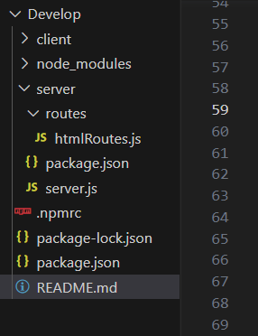
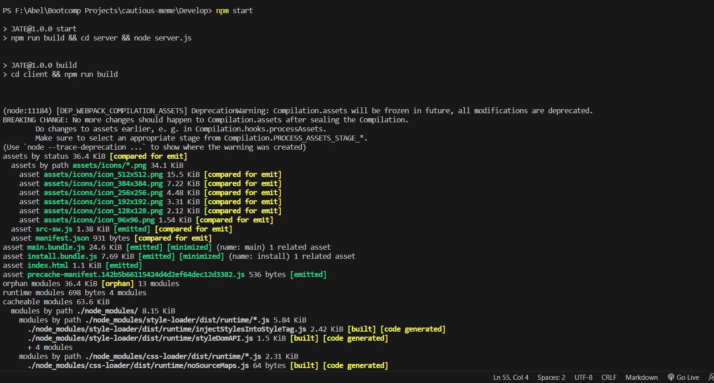
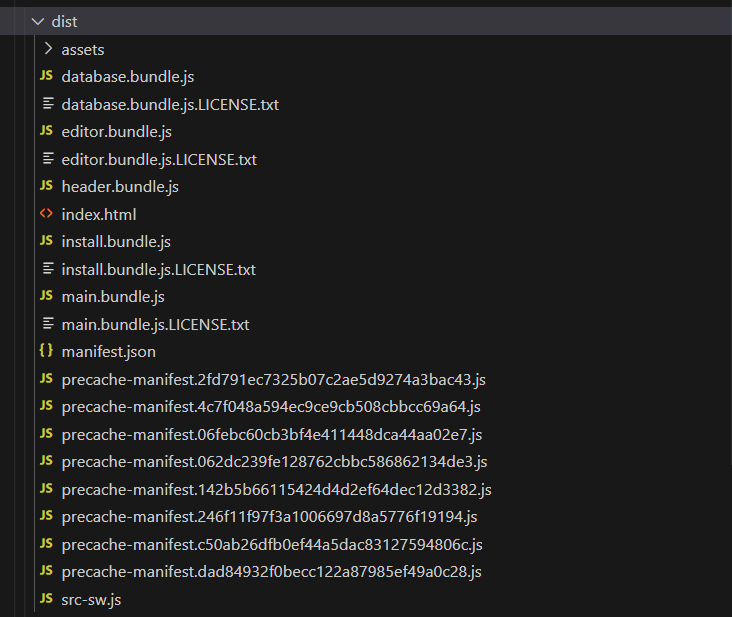
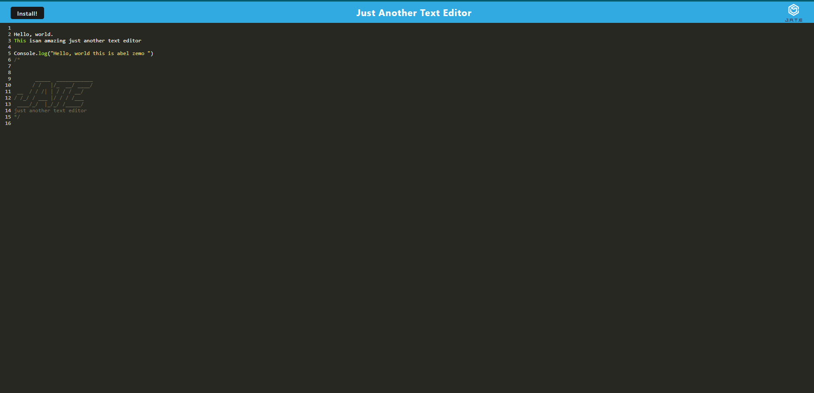
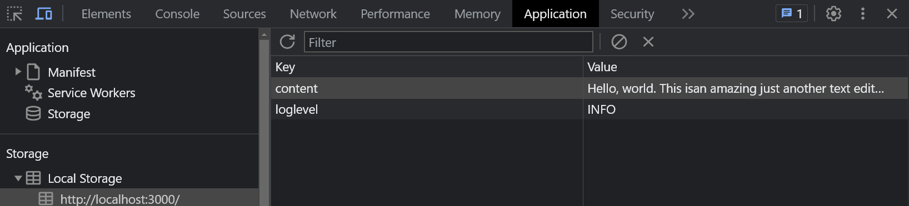
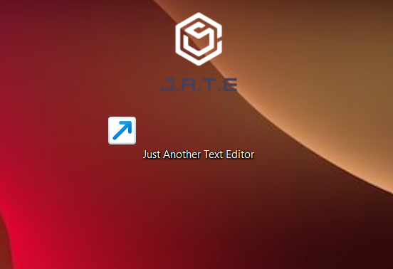
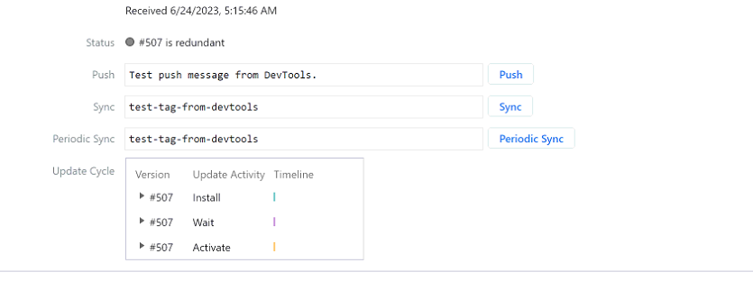
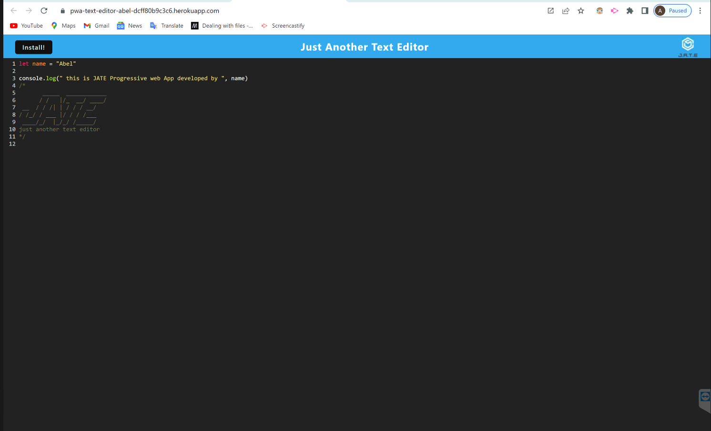

  # Progressive Web Applications (PWA) : Text Editor
  

  ## Table-of-Contents

  * [Description](#description)
  * [Installation](#installation)
  * [Usage](#usage)
  * [License](#license)
  * [Contributing](#contributing)
  
  ## [Description](#table-of-contents)

  This is a web text editor that helps a user to create notes or code snippets with or without an internet connection and where the user can reliably retrieve them for later use. The integrated service worker and Cache API's ensure that the application will remain fully functional even without and active internet connection. This application allows the user to access visited pages even if the application is offline.

  ## [Installation](#table-of-contents)

1. This text editor stores data to IndexedDB database to be builded up.

2. This application will require the installation of Node.js invironment and various npm packages.

This application will use the following npm packages:

    * npm install express (express.js)
    * npm install --save-dev webpack-pwa-manifest (WebpackPwaManifest)
    * npm install webpack-dev-server --save-dev (webpack-dev-server)
    * npm install babel (Babel)
    * npm install --save-dev webpack (Webpack)
    * npm install --save-dev css-loader (CSS-loader)
    * npm install concurrently --save (run multiple commands concurrently.) (Concurrently)
    * npm npm install idb (IndexedDB)
    * npm install --save-dev webpack (Webpack)
3. The required modules are bundled in the package.json file and integrated terminal (CLI) type in npm run install, the modules will be installed.

  ## [Usage](#table-of-contents)

1. Given a text editor web application, when you open my application in my editor then you should see a client server folder structure like below.

client server folder structure.   

2.     
  * WHEN I run `npm run start` from the root directory
  * THEN I find that my application should start up the backend and serve the client
  * WHEN I run the text editor application from my terminal
  * THEN I find that my JavaScript files have been bundled using webpack
  * WHEN I run my webpack plugins
  * THEN I find that I have a generated HTML file, service worker, and a manifest file

3. running at npm run start and npm run build

4. generated HTML, service worker and a manifest file

  
5. 
  * WHEN I use next-gen JavaScript in my application
  * THEN I find that the text editor still functions in the browser without errors
  * WHEN I open the text editor

Just Another Text Editor (J.A.T.E)

6. 

  * THEN I find that IndexedDB has immediately created a database storage
  * WHEN I enter content and subsequently click off of the DOM window
  * THEN I find that the content in the text editor has been saved with IndexedDB
  * WHEN I reopen the text editor after closing it
  * THEN I find that the content in the text editor has been retrieved from our IndexedDB

 content in the text editor has been retrieved from the IndexedDB

7. 
  * WHEN I click on the Install button
  * THEN I download my web application as an icon on my desktop

icon of JATE on the desktop

8. 
  * WHEN I load my web application
  * THEN I should have a registered service worker using workbox
  * WHEN I register a service worker
  * THEN I should have my static assets pre cached upon loading along with subsequent pages and static assets.

9. 

  * WHEN I deploy to Heroku
  * THEN I should have proper build scripts for a webpack application 

  ## [License](#table-of-contents)

  The application is covered under the following license:

  [agpl](https://choosealicense.com/licenses/agpl)
    
    
  ## [Contributing](#table-of-contents)

  I am the only contributor for this code after I get a template file.
  
  Please contact me using the following links:

  [GitHub](https://github.com/AbelZemo)

  [Email: AbelZemo](abelzemo@gmail.com)

This app is deployed on heroku : https://pwa-text-editor-abel-dcff80b9c3c6.herokuapp.com/
